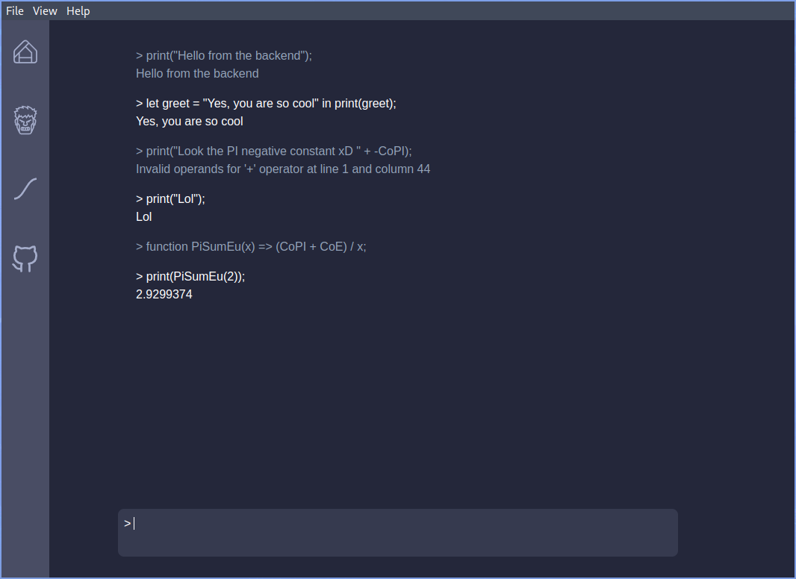

# Wallace

  

## Table of Contents

- [Requirements](#requirements)
- [How to use](#how-to-use)
- [Contributing](#contributing)
- [What it can do for the moment](#what-it-can-do-for-the-moment)

## Requirements

- [Git](https://git-scm.com/)
- [DotNet7.0](https://dotnet.microsoft.com/en-us/download/dotnet/7.0)
